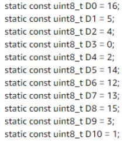
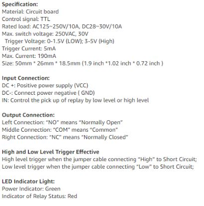
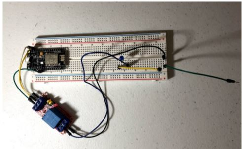
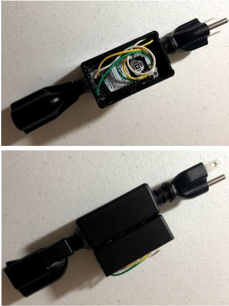
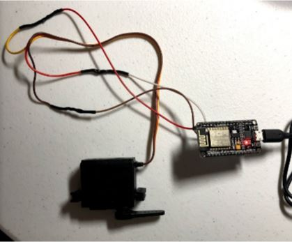
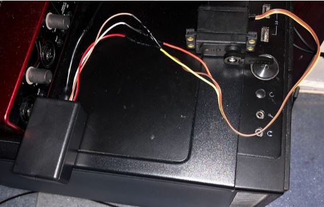

# Alexa-Smart-Devices

NodeMCU ESP8266 Smart Home Personal Project

1. Guidelines:
  - Alexa for turning on/off the room light and Computer
  - Smart outlet for room light
      1. Relays to control power source
  - Smart servo to turn on computer
  - ESP8266 for connection to Alexa

2. Parts:
  - NodeMCU ESP8266
  - Relays 
  - Metal gear standard servo motor
  - Plastic project boxes
  - Outlet extension cord

3. Links:
  - Documentation
      1. https://nodemcu.readthedocs.io/en/release/getting-started/ 
  - Product links
      1. https://www.amazon.com/gp/product/B081CSJV2V/ref=ppx_yo_dt_b_search_asin_title?ie=UTF8&th=1 
      2. https://www.amazon.com/gp/product/B07M88JRFY/ref=ppx_yo_dt_b_search_asin_title?ie=UTF8&psc=1 
      3. https://www.adafruit.com/product/1142 

4. Info: 
  - NodeMCU ESP8266
      1.Pinout 

  - Relays 
      1. Specifications 

5. Designs:
  - Smart light outlet
      - Relay control
        1. IN to D7
        2. DC+ to Vin
        3. DC- to GND
      - Relay power
        1. NO to power source
        2. COM to ground

  - Smart computer switch
    - Servo pins:
      1. PWM signal to D1
      2. Power to Vin
      3. Ground to GND

6. Issues: 
  - High pitch whine from PWM signal due to 8-bit MCU with 8-bit PWM signal generating a human audible sound through the wire as an antenna. Solved by setting delays into the code, changing the minimal interval to 15000, and changing the PWM frequency to 30000 instead of 1000 so the frequency will be out of the human hearing range
